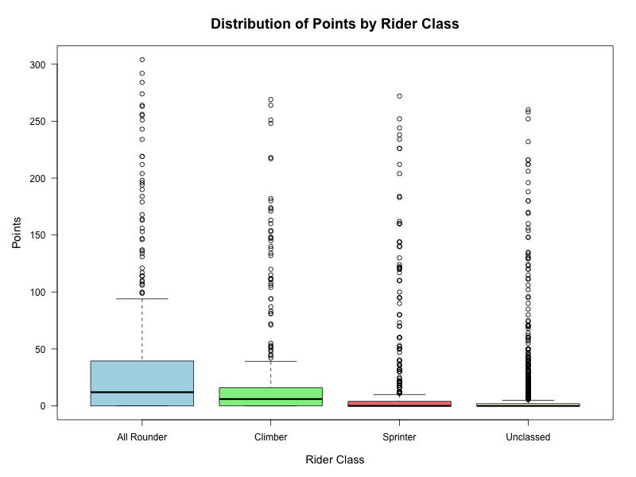
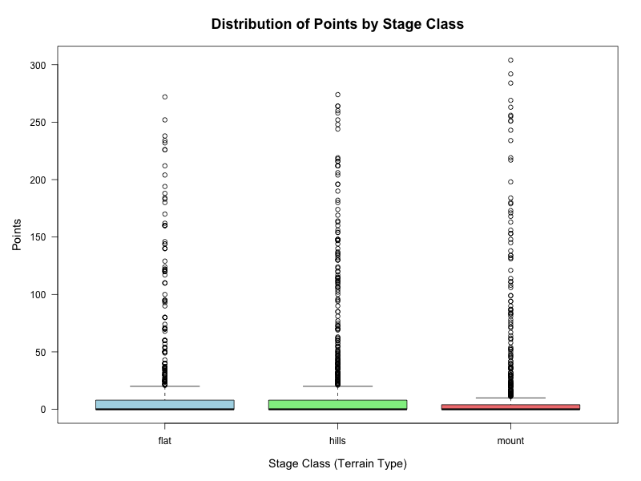
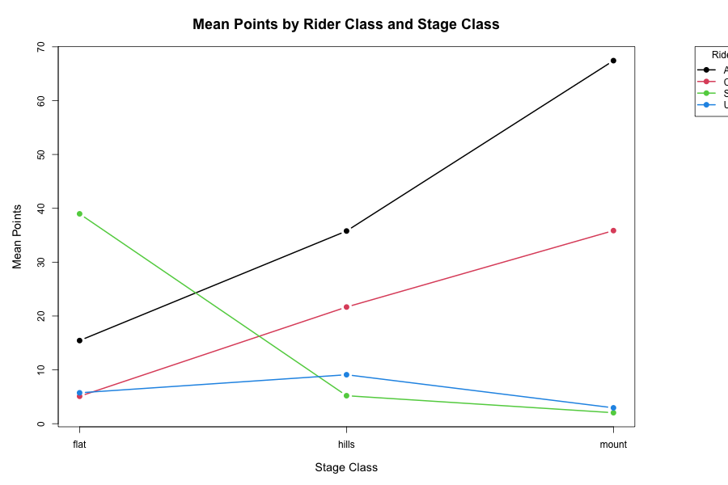

# Performance Analysis of Cycling Data

**Applicant:** Khondokar Nazran Ahmod
**Application for:** Master Data Science, TU Dortmund University
**Submitted to:** Prof. Dr. Andreas Groll
**Date:** January 2026

---

## Declaration

This report is prepared as part of the Data Analysis Self-Test required for admission to the Master's program in Data Science at TU Dortmund University. The analysis was done independently by me using the dataset provided by the university (cycling.txt from the official TU Dortmund statistics department website).

All analyses, interpretations, and writing were done by me without external help, except for the dataset provided by TU Dortmund and the R software used for calculations.

---

## 1. Introduction

This report analyzes the cycling dataset provided by TU Dortmund for the self-test. According to the task instructions, the dataset contains results from a cycling manager game where riders get points for their performance in different stages. The riders are classified into four categories (All Rounder, Climber, Sprinter, and Unclassed), and stages are classified as flat, hills, or mountain.

The main questions are:
- Is there a difference in performance between rider classes?
- How does performance compare across different stage types?

I will use descriptive statistics and statistical tests to answer these questions.

---

## 2. Data Description

### Dataset Overview

The dataset has 3,496 observations with the following variables:

| Variable | Description | Type |
|----------|-------------|------|
| all_riders | Rider name | Text |
| rider_class | Rider category | Categorical (4 levels) |
| stage | Stage number | Text (X1 to X21) |
| points | Performance points | Numeric |
| stage_class | Terrain type | Categorical (3 levels) |

### Basic Statistics

**Number of riders:** 184
**Number of stages:** 19
**Total observations:** 3,496

**Rider class distribution:**
- Unclassed: 2,185 observations (62.5%)
- Sprinter: 551 observations (15.8%)
- Climber: 437 observations (12.5%)
- All Rounder: 323 observations (9.2%)

**Stage class distribution:**
- Hills: 1,472 observations (42.1%)
- Flat: 1,104 observations (31.6%)
- Mountain: 920 observations (26.3%)

**Points distribution:**
- Mean: 12.39
- Median: 0
- Maximum: 304
- Standard deviation: 36.93

The data shows that 50% of observations have 0 points (median = 0), which means most riders don't score in most stages. Only a small number of riders get high points.

---

## 3. Methods

### Descriptive Statistics

I calculated mean, median, standard deviation, and quartiles for different groups. These are basic measures to understand the data distribution.

### Statistical Tests

Since the data is not normally distributed (median = 0, mean = 12.39), I used non-parametric tests:

**Kruskal-Wallis Test:** This test is like ANOVA but doesn't require normal distribution. It compares whether different groups come from the same distribution.

The test statistic is:
$$H = \frac{12}{n(n+1)} \sum_{i=1}^{k} \frac{R_i^2}{n_i} - 3(n+1)$$

where n is total sample size, k is number of groups, and R_i is the sum of ranks for group i.

**Wilcoxon Test:** For pairwise comparisons between groups after finding significant results.

**Why these tests?** The data has many zeros and is very skewed, so normal distribution tests (like t-test or ANOVA) would not be appropriate.

---

## 4. Results

### 4.1 Descriptive Analysis

**Performance by Rider Class:**

| Rider Class | N | Mean | Median | SD |
|-------------|---:|-----:|-------:|----:|
| All Rounder | 323 | 37.69 | 12.00 | 63.96 |
| Climber | 437 | 20.17 | 6.00 | 43.45 |
| Sprinter | 551 | 15.04 | 0.00 | 41.83 |
| Unclassed | 2185 | 6.42 | 0.00 | 23.28 |

All Rounders have the highest average points (37.69), followed by Climbers (20.17) and Sprinters (15.04). Unclassed riders have the lowest performance (6.42).

**Performance by Stage Type:**

| Stage Class | N | Mean | Median | SD |
|-------------|---:|-----:|-------:|----:|
| Flat | 1104 | 11.79 | 0.00 | 33.22 |
| Hills | 1472 | 12.52 | 0.00 | 36.13 |
| Mountain | 920 | 12.88 | 0.00 | 39.91 |

The average points are similar across stage types, but there are interesting patterns when we look at rider classes separately.

**Performance by Rider Class AND Stage Type:**

| Rider Class | Flat | Hills | Mountain |
|-------------|-----:|------:|---------:|
| All Rounder | 15.44 | 35.79 | 67.42 |
| Climber | 5.09 | 21.67 | 35.86 |
| Sprinter | 38.98 | 5.20 | 2.04 |
| Unclassed | 5.74 | 9.10 | 2.95 |

This table shows the important pattern:
- **All Rounders and Climbers** perform better on mountain stages
- **Sprinters** perform much better on flat stages (38.98) but very poorly on mountains (2.04)
- This makes sense because sprinters are good at flat terrain, while climbers are good at mountains

**Figure 1: Boxplot of Points by Rider Class**

The boxplot shows that All Rounders have the highest median performance, and there are many outliers (high-performing riders) in all categories.

**Figure 2: Boxplot of Points by Stage Class**

This shows that the distribution looks similar across stage types when we don't separate by rider class.

**Figure 3: Interaction Plot**

This is the most important figure. It shows how different rider types perform across different terrains:
- The lines are not parallel, which means there is an interaction effect
- All Rounders and Climbers (top lines) improve on harder terrain
- Sprinters (green line) decline sharply from flat to mountain stages

### 4.2 Hypothesis Testing

**Test 1: Are rider classes different?**

Kruskal-Wallis test result:
- H = 330.2, df = 3, p < 0.001

**Conclusion:** Yes, there are significant differences between rider classes (p < 0.001).

Post-hoc tests show that almost all pairs are different from each other.

**Test 2: Are stage classes different?**

Kruskal-Wallis test result:
- H = 9.52, df = 2, p = 0.009

**Conclusion:** Yes, there are some differences between stage types (p = 0.009), but the effect is smaller than rider class differences.

**Test 3: Is there an interaction?**

To test if the effect of stage type depends on rider class, I used ANOVA on ranks:

Result:
- Rider Class effect: F = 125.15, p < 0.001 (very significant)
- Stage Class effect: F = 5.41, p = 0.005 (significant)
- Interaction effect: F = 17.26, p < 0.001 (very significant)

**Conclusion:** Yes, there is a strong interaction. The effect of terrain on performance depends on what type of rider you are.

**Additional Tests:**

I also tested rider class differences within each stage type separately:

- On flat stages: χ² = 82.10, p < 0.001
- On hills: χ² = 156.40, p < 0.001
- On mountain stages: χ² = 183.16, p < 0.001

All are significant, but the chi-squared value increases with terrain difficulty, meaning rider class differences become more important on harder terrain.

---

## 5. Discussion and Conclusion

### Main Findings

1. **Rider classes perform differently** (p < 0.001): All Rounders score highest on average (37.69 points), while Unclassed riders score lowest (6.42 points).

2. **Performance depends on both rider type and terrain** (interaction p < 0.001):
   - Sprinters excel on flat stages (38.98 points) but perform very poorly on mountains (2.04 points)
   - Climbers and All Rounders perform better as terrain gets harder
   - This matches what we would expect in real cycling

3. **The interaction effect is important:** You can't just say "which rider class is best" - it depends on the terrain. Sprinters are best on flat stages, but worst on mountains.

### Practical Interpretation

For a cycling team manager, this means:
- Choose sprinters for flat stages
- Choose climbers or all-rounders for mountain stages
- All-rounders are most versatile across all terrains

### Limitations

1. This is data from a game, not real cycling, so results might be different in reality
2. The data has many zeros (50% of observations), which might need special statistical models
3. The same riders appear multiple times (repeated measures), but I treated all observations as independent in the tests
4. Most riders are "Unclassed" (62.5%), so the categories are unbalanced

### Task Compliance

This report fulfills the requirements of the TU Dortmund self-test:

**(a) Descriptive analysis:** I provided descriptive statistics (mean, median, SD) for different groups and included three statistical graphics (boxplots and interaction plot) to visualize the data.

**(b) Hypothesis tests:** I used Kruskal-Wallis tests to compare groups, with justification that non-parametric tests are appropriate because the data is not normally distributed (median = 0, very skewed). I also tested for interaction effects.

---

## References

Agresti, A., & Finlay, B. (2018). *Statistical Methods for the Social Sciences*. Pearson.

Hollander, M., Wolfe, D. A., & Chicken, E. (2013). *Nonparametric Statistical Methods*. John Wiley & Sons.

Kruskal, W. H., & Wallis, W. A. (1952). Use of ranks in one-criterion variance analysis. *Journal of the American Statistical Association*, 47(260), 583-621.

R Core Team. (2024). *R: A Language and Environment for Statistical Computing*. R Foundation for Statistical Computing.

---

**End of Report**

**Signed:** Khondokar Nazran Ahmod
**Date:** January 9, 2026
